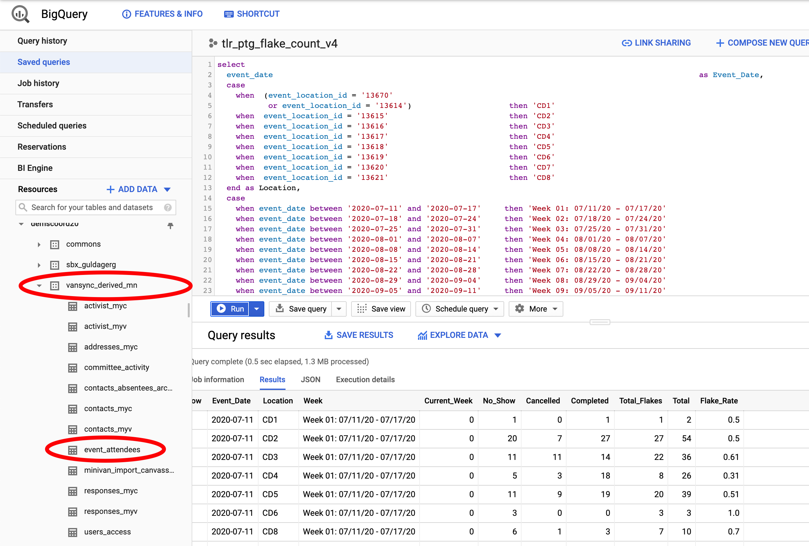

# GD Data Pipeline Final Project

## Project Description

I am currently working as a DigiDem on the Minnesota Coordinated Campaign for the 2020 Campaign Cycle.

In this capacity I work on the data team and have been asked to create a Flake Rate report for our field team so that they can track how many volunteers that are scheduled to do phone bank shifts actually complete these shifts. A general rule of thumb for flake rate is 50% of the people recruited for any event, phone bank, or canvass, will not show up as promised. The field team will be able to monitor this flake rate by week (current week is Saturday to today), region and organizer (eventually) so that they can better plan how many volunteers to recruit and monitor confirmation best practices.

In addition, we will build on this report in the coming weeks to redo PTG goals and metrics based on newly defined regions and turf as well as other contact methods.

## Data sources
The data source used for this report is from the Minnesota DFL VAN MyCampaign Events Signup and related data tables to pull the source data and lists, specifically phonebank volunteer shift signups. This data is synced with the DNC Phoenix/Big Query on a daily basis and so the actual data source tables are located in Big Query. Future iterations created for PTG and other metrics will also use Activity and Turf tables.

## Query

## Pipeline Setup
What tools do you plan to use?
BigQuery/DNC Phoenix (holds synced VAN data), DNC Portal, Google Sheets, Data Studio for Visualization/Dashboard
What QA (or other sanity) checks would you add to ensure the pipeline is working as intended?
Periodically run an Events Participation report out of VAN to check totals for a day/week. 

## Data Studio Visualization

Final Project Benchmark 3
Gloria Guldager
Pipeline Project: Field Team Organizer Flake Rate report for Volunteer Shifts Completed

What is your plan to complete the project? 

My plan to complete the project is to spend time on Monday tweeking my dashboard visualization and also create a draft of the slide deck and executive summary. Monday evening I have signed up for office hours with Shoham to address any final questions I have on my visualization.

On Tuesday I will make final edits to the slide deck and executive summary. In addition I will practice my presentation to prepare for the evening presentation.

At this point, I have all of the data, query, pipeline components, automation and the visualization dashboard created. I have tweeks I would like to make to the visualization and I need to create the slide deck and the executive summary.

I94 Immigration Data: This data comes from the US National Tourism and Trade Office Source. This data records immigration records partitioned by month of every year.
World temperature Data: This dataset comes from Kaggle Source. Includes temperature recordings of cities around the world for a period of time
US City Demographic Data: This dataset comes from OpenSoft Source. Includes population formation of US states, like race and gender.
Aiport Code table: Source. Includes a collection of airport codes and their respective cities, countries around the world.
Data Lake Star Schema designs
The decision to build a Data Lake on S3 is due to:
Ease of schema design, rely on schema-on-read
Flexibility in adding / removing additional data
Availability to a wide range of users with access to the S3 bucket
Table designs
Normalized us city: built on city code data from raw airport and demographics data
Normalized us airport: built on raw airport data, filtered for US airports, joined with city table to get city_id
Each airport can either be identified by icao_code or iata_code or both
Normalized country: built on country codes from I94 immigration dictionary
Normalized us state code: built on state codes from I94 immigration dictionary
Normalized us weather: built on global weather data, filtered for US cities, joined with city table to get city_id
Filtered for weather data in the US at the latest date
The raw weather data only has temperatures on a fraction of all the cities in the US
Some cities in the data are duplicates, but that means they're on different states of the US. However the state is not available in the data, but instead we have the latitude - longitude coordinates. This issue is currently NOT addressed in this project, but in a production setting,we should join the latitude - longitude from weather dataset with this data, which includes city coordinates and their respective states
Normalized us demographics: built on raw demographics data, not much transform is needed
Denormalized airport weather: Joining weather data with airport location, to get the respective weather information for each US airports
Normalized immigrant: Information about individual immigrants, like age, gender, occupation, visa type, built on I94 Immigration dataset
Normalized immigration table: Information about immigration information, such as date of arrival, visa expiry date, airport, means of travel
Denormalized immigration demographics: Joining immigration with demographics data, to get the population of places where immigrants go
AWS Infrastructure
The AWS infrastructure is set up according to this tutorial
Upload the CloudFormation script to create the resources, such as EC2 instance, RSD database for Airflow, security groups, S3 bucket
Then connect to the EC2 instance:
sudo su
cd ~/airflow
source ~/.bash_profile
bash start.sh
bash run_dags.sh
ETL
dag_cluster: start the EMR cluster, and wait for all data transformation is finished, then terminate the cluster
alt text

dag_normalize: wait for EMR cluster to be ready, then use Apache Livy REST API to create interactive Spark session on the cluster, submit a Spark script to read data from S3, do transformation and write the output to S3
This DAG handles normalized tables
alt text

dag_analytics: wait for EMR cluster to be ready, and that normalized tables are processed, then read normalized tables to create analytics tables, and write to S3
This DAG handles immigration data, which is partitioned for 12 months from jan-2016 to dec-2016
To re-run this DAG, change the DAG name, then delete the existing DAG from Airflow, and refresh the UI
alt text

Possible errors
Livy session NOT started, restart EMR, restart Airflow scheduler
Scenarios
Data increase by 100x. read > write. write > read

Redshift: Analytical database, optimized for aggregation, also good performance for read-heavy workloads
Cassandra: Is optimized for writes, can be used to write online transactions as it comes in, and later aggregated into analytics tables in Redshift
Increase EMR cluster size to handle bigger volume of data
Pipelines would be run on 7am daily. how to update dashboard? would it still work?

DAG retries, or send emails on failures
daily intervals with quality checks
if checks fail, then send emails to operators, freeze dashboard, look at DAG logs to figure out what went wrong
Make it available to 100+ people

Redshift with auto-scaling capabilities and good read performance
Cassandra with pre-defined indexes to optimize read queries

