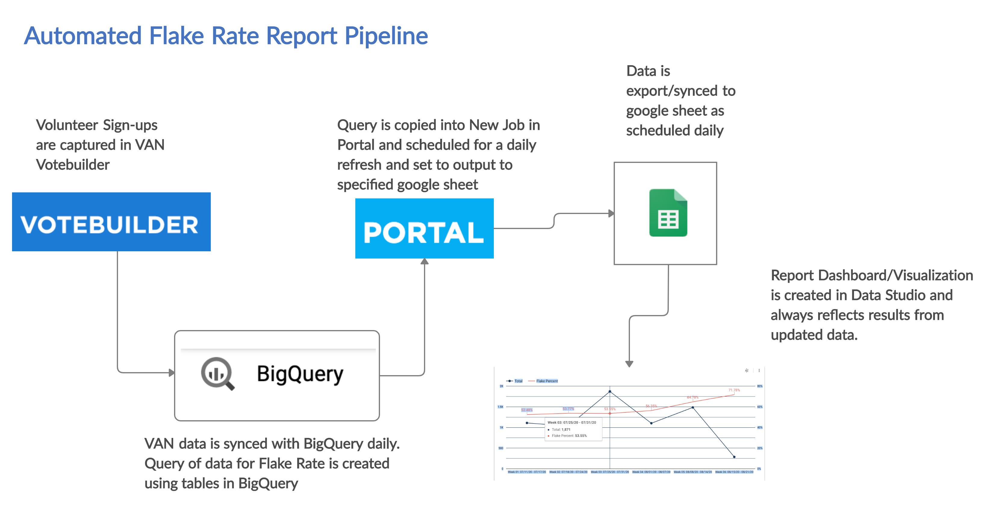

# GD Data Pipeline Final Project

## Project Description

I am currently working as a DigiDem on the Minnesota Coordinated Campaign for the 2020 Campaign Cycle.

In this capacity I work on the data team and have been asked to create a Flake Rate report for our field team so that they can track how many volunteers that are scheduled to do phone bank shifts actually complete these shifts. A general rule of thumb for flake rate is 50% of the people recruited for any event, phone bank, or canvass, will not show up as promised. The field team will be able to monitor this flake rate by week (current week is Saturday to today), region and organizer (eventually) so that they can better plan how many volunteers to recruit and monitor confirmation best practices.

In addition, we will build on this report in the coming weeks to redo PTG goals and metrics based on newly defined regions and turf as well as other contact methods.

## Data sources
The data source used for this report is from the Minnesota DFL VAN MyCampaign Events Signup and related data tables to pull the source data and lists, specifically phonebank volunteer shift signups. This data is synced with the DNC Phoenix/BigQuery on a daily basis and so the actual data source tables are located in BigQuery. We are specifically pulling from the vansync_derived_mn table that contains data for the most recent update per volunteer sign-up so that we know we are getting the final result. Future iterations created for PTG and other metrics will also use Activity and Turf tables.

## Query
The Query created for this report pulls the last result for each volunteer sign-up by event_date and from that result categorizes by event_location_id (our region), by week (we count weeks from Saturday to Friday), defines Current_Week, and counts No_Show, Cancelled, Completed, Total_Flakes, Total sign-ups, and the Flake_Rate.

There is also a version of the Query that will be used for additional reports that adds columns for Future_Week and counts Scheduled events.

https://github.com/GloGuldager/GDDataPipelineProject/blob/master/FlakeRateQuery

## Pipeline Setup
The Pipeline starts with event data being captured in VAN Votebuilder. The organizers update this information for the volunteers after all of their shifts each day. All of the VAN tables are synced daily to BigQuery/DNC Phoenix where the query is written to pull the event sign-ups as well as the most recent status for each volunteer. The Query is copied and placed in a job on the DNC Portal. This is where the query is scheduled to run daily (or at whatever interval is desired) and the Google Sheet is defined where the results from the query will be placed after each refresh. This Google Sheet becomes the data source for a Dashboard and Visualizations in Data Studio.

To ensure that my pipeline is working as intended, I will occasionally run Events Participations reports from Votebuilder to check totals for a particular day/week or by region. 

## Data Studio Visualization
A pivot table and a line chart were created to show the totals and the flake rate by week and region. The most recent or current week displays data that may be for a partial week. Organizing weeks run from Saturday to Friday. In the near future, the visualization will be updated to reflect new region and turf designations as well as the ability to display by organizer, if desired.

The visualization was designed to reflect the current branding protocols of the organization including the logo and color scheme.

The completed Dashboard may be viewed at this URL.

https://datastudio.google.com/reporting/c9776d59-d434-4d83-b8a3-37f0194ef82c

